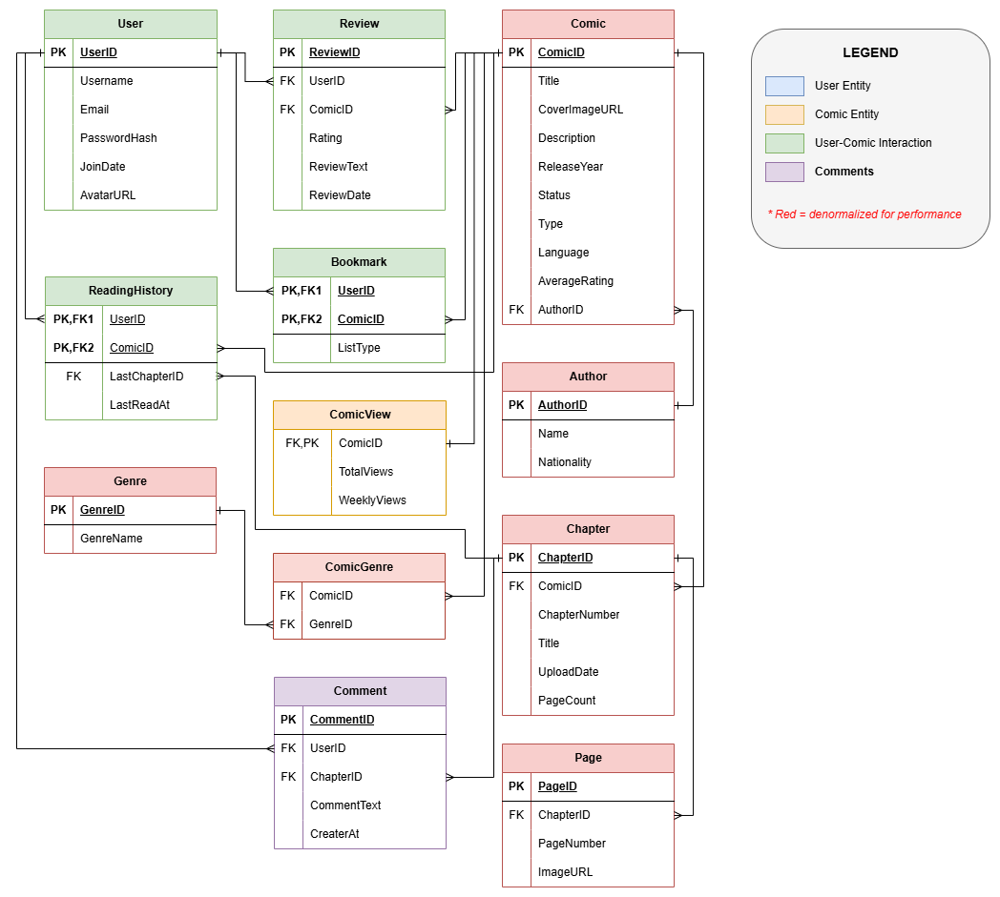

# CapyToons.to - Comic Reading Platform

## Project Overview
**CapyToons.to** is a web-based comic reading platform. It serves as a centralized, reliable repository for manga, manhwa, manhua, and webtoons, aggregating content from diverse origins into a single interface. 

The system addresses common issues in the comic-reading community, such as platform outages and poor metadata consistency, by providing a robust database-driven alternative.

## Key Features
* **Advanced Search & Filter**: Discover titles by genre, type (manga/webtoon), status, language, year, and author.
* **Personalized Experience**: Registered users receive recommendations based on reading history, ratings, and bookmarks.
* **Reading History**: Automatically tracks the last-read chapter per comic for each user.
* **Community Interaction**: Integrated rating (1-5 stars) and text review system.
* **Admin Management**: Dedicated panel for managing comics and chapters.
* **Reporting**: Generates trending and popularity reports based on view counts.

## Technology Stack
* **Frontend**: React.js, Tailwind CSS
* **Backend**: Node.js, Express.js
* **Database**: MySQL
* **Scripts**: Python (utilizing MangaDex API for data seeding)

## Database Design
The core of CapyToons is a relational database designed to ensure data integrity and fast retrieval.

### Entity-Relationship Diagram (ERD)
The database structure utilizes Crow-Foot notations to represent relationships between entities.

* **Green Tables**: User-related data (History, Bookmarks, Reviews).
* **Pink Tables**: Comic-related data (Authors, Genres, Chapters, Pages).

> **Note:** For the full technical breakdown, refer to the following project files:
> * **[Comic_Reading_Platform.pdf](Comic_Reading_Platform.pdf)**
> * **[versionControl.docx](versionControl.docx)**

## Project Structure
The current repository includes:
* **`versionControl.docx`**: Contains the full ERD and schema details.
* **`workflow.flowchart`**: Visual representation of the system logic.

* **Python Scripts**: Used to populate the database with ~50 comics and ~100 chapters via the MangaDex API.
* **Backend Routes**: Initial implementation of the API structure.

## Project Members
* **Hadia Khan**
* **Hamna Rehman**
* **Program**: BSSE-B (2024-28), IM Sciences
