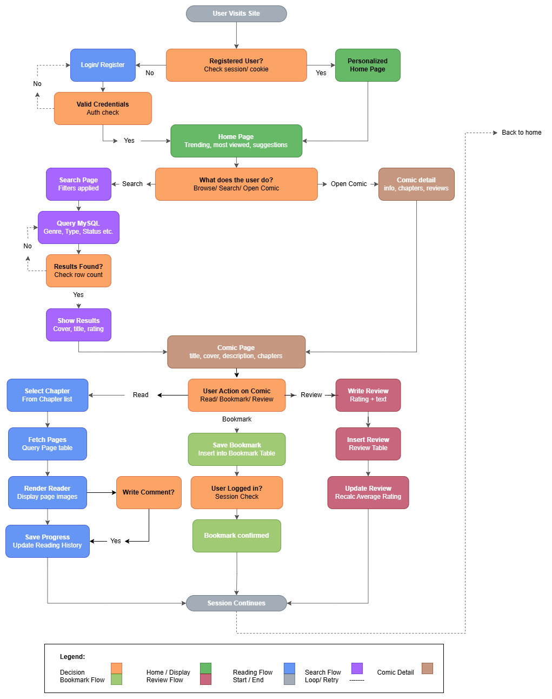

# CapyToons.to - Comic Reading Platform

## Project Overview
**CapyToons.to** is a web-based comic reading platform. It serves as a centralized, reliable repository for manga, manhwa, manhua, and webtoons, aggregating content from diverse origins into a single interface. 

The system addresses common issues in the comic-reading community, such as platform outages and poor metadata consistency, by providing a robust database-driven alternative.

## Key Features
* **Advanced Search & Filter**: Discover titles by genre, type (manga/webtoon), status, language, year, and author.
* **Personalized Experience**: Registered users receive recommendations based on reading history, ratings, and bookmarks.
* **Reading History**: Automatically tracks the last-read chapter per comic for each user.
* **Community Interaction**: Integrated rating (1-5 stars) and text review system.
* **Admin Management**: Dedicated panel for managing comics and chapters.
* **Reporting**: Generates trending and popularity reports based on view counts.

## Technology Stack
* **Frontend**: React.js, Tailwind CSS
* **Backend**: Node.js, Express.js
* **Database**: MySQL
* **Scripts**: Python (utilizing MangaDex API for data seeding)

## Database Design
The core of CapyToons is a relational database designed to ensure data integrity and fast retrieval.

### Entity-Relationship Diagram (ERD)
The database structure utilizes Crow-Foot notations to represent relationships between entities.

* **Green Tables**: User-related data (History, Bookmarks, Reviews).
* **Pink Tables**: Comic-related data (Authors, Genres, Chapters, Pages).

> **Note:** For the full technical breakdown, refer to the following project files:
> * **[Comic_Reading_Platform.pdf](./docs/Comic_Reading_Platform.pdf)**

## Project Structure
The current repository includes:

* **`normalization.md`**: CapyToons schema is normalized to 3NF with two justified denormalizations for performance.
* **[normalization.md](./docs/normalization.md)**

* **`Population Scripts`**: The database was populated using Python-based ETL scripts that fetched real-world comic data from the MangaDex API and generated synthetic user interaction data for reviews and ratings. The cleaned and transformed data was directly inserted into the MySQL database using structured insertion logic with duplicate prevention and relational mapping. As a result, all core tables were successfully populated, including high-volume tables such as Comic, Chapter, Page, User, and Review, ensuring a complete and consistent dataset for further validation and testing.

* The Scripts used were;
* **[populatepopulate_capytoons.py](./scripts/populate_capytoons.py)**
* **[populate_reviews.py](./scripts/populate_reviews.py)**

* **`dataflow.md`**: Capytoons uses an ETL pipeline to process manga and user data into a normalized MySQL database.
* **[dataflow.md](./docs/dataflow.md)**

* **`schema.sql`**: The Entire DDL commands for the Schema of Capytoons can be found at schema.sql.
* **[schema.sql](./schema/schema.sql)**

* **`DML Validatons`**: DML testing was performed to verify that the database correctly supports data manipulation and maintains integrity after modifications. This included executing controlled UPDATE and DELETE operations with specific WHERE conditions to ensure selective changes without affecting the entire dataset. After data loading and modifications, four JOIN-based integrity tests were performed to validate foreign key relationships across key tables. In addition, row count checks using COUNT(*) were executed on all tables to confirm successful data insertion, and NULL value checks were performed on key columns to ensure data completeness. These combined tests confirmed that the database is consistent, fully populated, and maintains proper relational integrity across all entities.
* For the Tests script, see;
* **[DML-tests.sql](./scripts/DML-tests.sql)**
* For the Verification Screenshots, see;
* **[DML-validtion Screenshots](./scripts/DML-validtion Screenshots)**

* **`workflow.flowchart`**: Visual representation of the system logic.

* **Python Scripts**: Used to populate the database with ~50 comics and ~100 chapters via the MangaDex API.
* **Backend Routes**: Initial implementation of the API structure.

## Project Members
* **Hadia Khan**
* **Hamna Rehman**
* **Program**: BSSE-B (2024-28), IM Sciences
